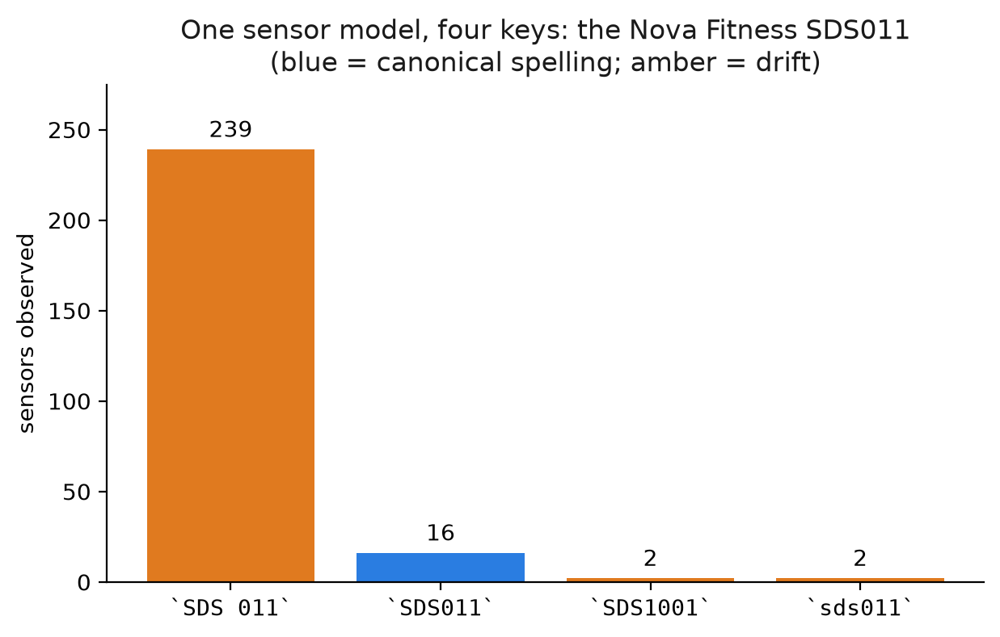
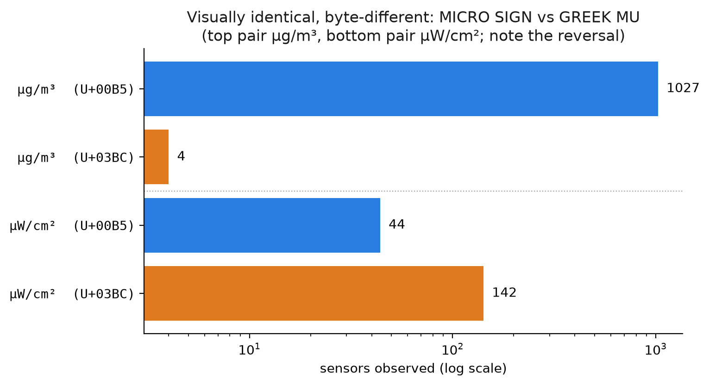

# anchorkey

[](https://doi.org/10.5281/zenodo.20989076)
[](LICENSE)

**Identity resolution under identifier drift: earn a stable natural key from messy observed
strings, merge only what can be proven identical, and defer the rest to a human.**

When a pipeline gives every *observed identifier string* its own primary key, one physical
thing fragments into many keys the moment that string drifts, and in the real world it always
drifts. Then every count and average computed across the fleet is silently wrong, and nothing
throws an error. `anchorkey` is a small, dependency-free library that *anchors* identity to a
**stable natural key** derived from messy observed names, so the same thing collapses to the
same key.

It is the reference implementation for a technical paper series on surrogate-key failure under
identifier drift (links below). Every number in the docs comes from real, public openSenseMap
sensor data.

> **A research and educational reference implementation.** This accompanies a technical paper
> series and is a personal learning project, provided as-is under Apache-2.0 with no warranty.
> It is not a commercial product or service.

```
SDS 011   ─┐
SDS011    ─┼─ normalize() ─▶  "sds011"
sds011    ─┘
SDS1001   ──── stays separate — a typo, not a spelling variant. Deferred to review, not guessed.
```

---

## The problem, in one real picture

Pull the public sensor stations in one city from [openSenseMap](https://opensensemap.org) and
look at how a single sensor model, the Nova Fitness SDS011, writes its own name:



The most common spelling is not the one you would guess. A fleet count keyed on this string is
wrong in the **majority** case, not at the margin. And it gets worse below the surface, where
two units can be byte-different while looking identical:



`µg/m³` written with MICRO SIGN (`U+00B5`) and with GREEK SMALL LETTER MU (`U+03BC`) are
indistinguishable to the eye and different to the database. A `GROUP BY unit` treats them as
two units forever.

---

## Quickstart (under a minute)

```bash
pip install -e .
python examples/quickstart.py
```

```python
from anchorkey import normalize, same_entity, needs_review, natural_key

normalize("SDS 011") == normalize("sds011")     # True  — spacing/case drift gone
normalize("µg/m³")   == normalize("μg/m³")       # True  — look-alike Unicode collapsed
normalize("PM2.5")   != normalize("PM25")        # True  — meaningful "." preserved

same_entity("SDS 011", "sds011")                 # True   — proven identical
same_entity("hdc1008", "hdc1080")                # False  — two REAL TI parts, never merge
same_entity("hdc1080", "hhdc1080")               # False  — a typo, but not ours to decide
needs_review("hdc1080", "hhdc1080")              # True   — route it to a person

natural_key("MPU-6050")                          # "mpu6050"  — the key to store under
```

---

## What it does (and deliberately does not)

| Concern | `anchorkey` | Note |
|---|---|---|
| Spacing / case drift | ✅ `normalize` | `SDS 011` → `sds011` |
| Look-alike Unicode | ✅ `normalize` | MICRO SIGN vs GREEK MU, sub/superscripts |
| Meaningful punctuation | ✅ preserved | `PM2.5` stays distinct from `PM25` |
| Idempotent keys | ✅ guaranteed | `f(f(x)) == f(x)`, pinned by a property test |
| Unresolved pairs surfaced | ✅ `needs_review` | "not proven identical" ≠ "proven different" |
| Typo correction | ⛔ **evaluated and rejected** | not an omission — see below |
| Cross-source identity | ⛔ not yet | needs external catalog knowledge |

### Why there is no fuzzy matching

The obvious next step — merge keys that are "close enough" under a string-similarity metric —
was implemented, measured, and discarded. Five metrics (plain Levenshtein, Damerau-Levenshtein,
Jaro-Winkler, q-gram Jaccard, and a two-stage digit-core matcher) were scored against
hand-verified ground truth on the captured snapshot.

**All five overlap.** Every threshold that merges a genuine typo also merges two genuinely
different real parts. The clearest case:

| pair | truth | every metric says |
|---|---|---|
| `hdc1080` / `hhdc1080` | a typo — one real TI part, one string naming nothing | similar |
| `hdc1008` / `hdc1080` | **two real TI parts** | similar, or *more* similar |

Tuning does not help, because the deciding fact is not in the string: whether `bmp280` and
`bme280` name one part or two is a property of Bosch's catalog, not of those six characters.
A catalog is external knowledge, and it is time-variant — a string that names nothing today
may name a shipping part next year.

So this library merges the certain and defers the rest, with the raw strings preserved, to a
human-adjudicated **effective-dated label** applied at query time. The labels are never fed
back as training signal, which is what keeps identity a reproducible function of content
rather than of accumulated history.

- Measurement: [`data/separability_sample.py`](data/separability_sample.py)
- Ground truth: [`data/ground_truth_catalog.csv`](data/ground_truth_catalog.csv) — 12 real
  parts and 3 confirmed non-parts, each checked against a manufacturer datasheet, plus one
  string that could not be resolved either way and is excluded from scoring. That unresolved
  row is worth reading: it is the argument happening to the experiment itself.

**Design stance:** the core library has **zero runtime dependencies** and is pure standard
library, on purpose. This identity logic should be readable, auditable, and easy to vendor.
The code is commented to be followed by readers who do not write Python.

---

## Scope

Identifier fields (`sensorType`, `unit`) — atomic, effectively single-token strings.

Descriptive fields are **out of scope**. In the reference dataset the `title` field holds
measurand labels in mixed languages (`Temperatur`, `rel. Luftfeuchte`, `PM10`), not device
names: naming *what is measured* is a different problem from naming *what measured it*.

---

## Structure

The package is organised by pipeline stage, mirroring the paper series:

```
anchorkey/
  ingestion/           normalize observed strings into stable natural keys      (Paper 1)
  entity_resolution/   natural keys + the boundary of safe automation           (Paper 2)
```

Nothing here advertises a capability that does not exist. Where a problem cannot be solved
soundly, the library says so and hands it to a person, rather than shipping a plausible guess.

---

## Why a separate layer, and where it sits

Device-identity frameworks like [Eclipse Ditto](https://eclipse.dev/ditto/) and
[Eclipse Hono](https://eclipse.dev/hono/) manage device twins and provisioning on the
assumption that a *stable device identity already exists*. `anchorkey` is the layer
underneath: it earns that identity when the world hands you 88 different ways to write a unit.

---

## The paper series

1. **Surrogate-key failure under identifier drift** — the diagnosis, on real openSenseMap data.
   [*Published on Towards Data Science.*](https://towardsdatascience.com/avoiding-entity-key-drift-in-a-data-lake-step-1-normalization/)
   *(this repo backs it)*
2. **Entity resolution with natural keys** — where string similarity stops working, why the
   failure is structural, and the effective-dated label layer it forces.
   *Published on Towards Data Science — link to follow.* *(this repo backs it)*
3. Resource optimization — adaptive cadence and noise filtering. *(planned)*
4. Idempotent storage architecture and immutable snapshots in a data lake. *(planned)*

---

## Reproduce the data

Four scripts regenerate every number the papers quote. Each one cross-checks its own output
against the published values and **exits non-zero on a mismatch**, so the prose and the code
cannot drift apart quietly:

```bash
python data/pull_drift_sample.py        # re-pull the live openSenseMap sample (optional)

python data/collapse_sample.py          # what normalization DOES fix: 114 keys -> 99
python data/keyshape_sample.py          # what the residual is made of: 52 codes, 94% of rows
python data/separability_sample.py      # what it cannot fix, and why no metric finishes the job
python data/review_queue_sample.py      # what deferring costs: 30 pairs, then ~4 a year
```

A fifth script, `data/make_figures.py`, regenerates the figures in Paper 2 (it needs the
`figures` extra: `pip install -e ".[figures]"`).

A captured snapshot ships in `data/raw_snapshot.json` so the numbers above are stable even as
the live data drifts, which is, fittingly, the whole point.

### What this layer still cannot do

`review_queue_sample.py` measures its own blind spot, because a limitation stated only in prose
is not evidence. Every blocking rule available is a string-distance or string-overlap rule, so
it proposes near-duplicates and nothing else. Two keys naming the same part but sharing no
characters are never proposed, and no human is ever asked about them.

The worked case is `dht22` versus `AM2302`: one sensor, two names, edit distance 5, zero shared
bigrams, and **none of the five blocking strategies proposes the pair**. Aliases are strictly
harder than typos, and closing that gap needs a catalog carrying alias tables, not a cheaper
blocking rule. This library declines to guess, which beats being wrong and is not the same as
being finished.

## Develop

```bash
pip install -e ".[dev]"   # pytest + hypothesis
pytest                    # includes the idempotency property test
```

The test suite covers the discarded fuzzy-matching approach as well as the shipped code. The
measurement is the paper's evidence, and evidence has to stay true: if a future change ever
made a metric separable, the suite fails loudly instead of the code and the prose drifting
apart in silence. The same applies to the limitations — the alias blind spot above is pinned
by tests, so it cannot quietly stop being true either.

## Data and citation

The measurements in this repository are computed from one archived capture of the public
openSenseMap API, deposited on Zenodo and citable on its own:

**[openSenseMap identifier-drift sample (719 boxes, 2026-06-26)](https://doi.org/10.5281/zenodo.20989076)**
· DOI [`10.5281/zenodo.20989076`](https://doi.org/10.5281/zenodo.20989076)

That is the **concept DOI**: it always resolves to the newest version, so it is the one to cite.
Each release is also pinned at its own version DOI if you need to reference the exact files used.
The deposit carries the raw snapshot, every analysis script, the hand-verified ground-truth
catalog, and the figures.

Live API counts drift over time, which is the subject of this work, so every number quoted in
the docs derives from that frozen snapshot rather than from a live call. Nothing here needs
network access to reproduce.

To cite the software itself, use [CITATION.cff](CITATION.cff) or the **"Cite this repository"**
button in the GitHub sidebar.

---

## If this was useful

⭐ **A star helps other people hit the same bug find this.** That is the only reason it is worth
anything here: search and GitHub's own ranking both weight it, and this is a narrow problem that
people only look for once it has already cost them a week.

If you have hit identifier drift in your own pipelines, [open an
issue](https://github.com/saharah-99/anchorkey/issues) and say how it showed up. Cases from other
domains are genuinely wanted — the argument in the papers is that the deciding fact lives outside
the string, and every new domain that turns out to be true in makes it stronger. A counter-example
would be even more interesting: if you found a matcher that *did* hold up on short alphanumeric
codes, that is a result worth hearing about.

See [CONTRIBUTING.md](CONTRIBUTING.md). Licensed under [Apache-2.0](LICENSE).
